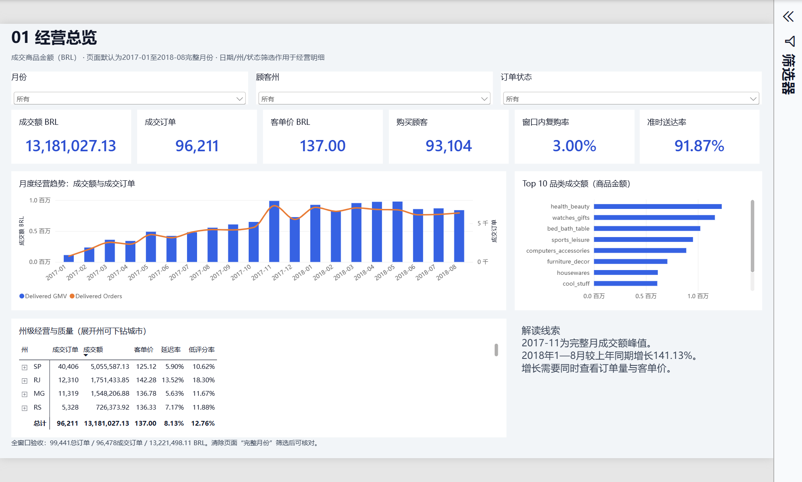
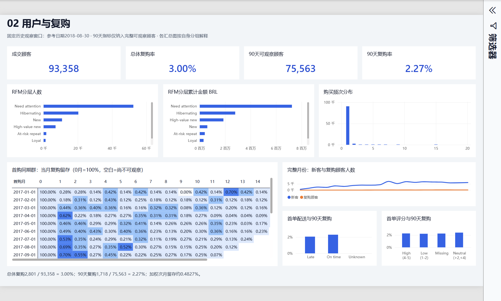
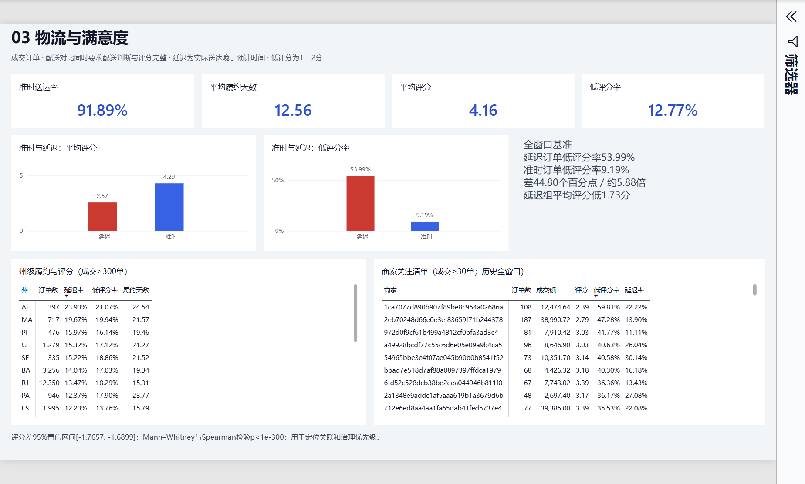
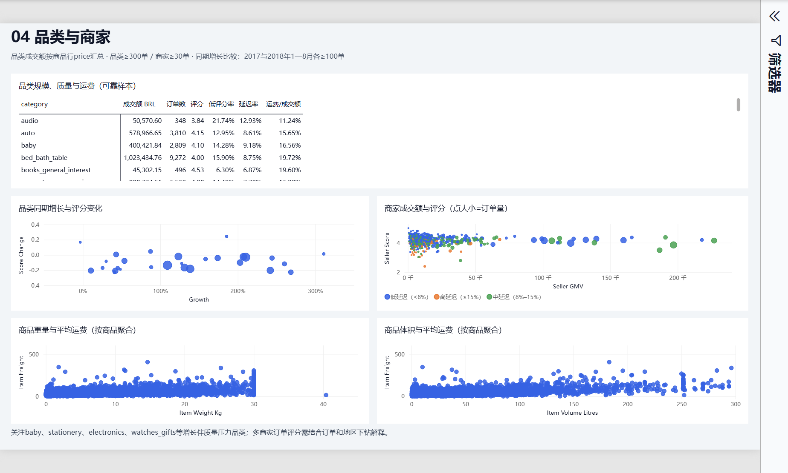

# 电商经营分析与复购诊断：最终验收

验收日期：2026-10-05。状态：完成。

## 1. 交付文件

- [最终本地四页看板](../powerbi/olist_ecommerce_analysis.pbix)
- [可编辑Power BI项目](../powerbi/Olist.pbip)，配套`Olist.Report`和`Olist.SemanticModel`目录
- [完整项目流程、计算细节和学习复盘](../docs/project_complete_walkthrough.md)
- [业务结果](findings.md)、[逐步搭建清单](../powerbi/build_checklist.md)
- 原始用户看板备份：`powerbi/backups/olist_before_completion.pbix`

本次不修改简历与原始CSV。最终看板在Power BI Desktop中实际保存为PBIX，关闭后重新打开，完成“主页 → 刷新”，再保存。四个页面均有正常图表和数据。

## 2. 自动检查

| 检查 | 结果 | 证据 |
|---|---|---|
| Python自动化测试 | 31/31通过 | `python -m unittest discover -s tests -v`；本轮14.607秒 |
| 11张Power BI输入预检 | 41/41通过 | `src/inspect_powerbi_inputs.py` |
| 实际Power BI模型DAX核对 | 45/45通过 | [desktop_verification.json](../powerbi/desktop_verification.json) |
| 可编辑报告结构验证 | 0错误、0警告 | [validation.json](../powerbi/validation.json) |

Python测试覆盖订单唯一、金额守恒、数据质量、指标分母、90天观察窗口、RFM、同期群、统计检验和经营诊断。实际DAX查询验证的不是Python结果副本，而是最终PBIX重新打开和刷新后的模型。

## 3. 实际模型基准

| 全数据窗口指标 | 实际核对结果 |
|---|---:|
| 总订单 | 99,441 |
| 成交订单 | 96,478 |
| 成交商品金额GMV | 13,221,498.11 BRL |
| 客单价 | 137.04 BRL |
| 成交顾客 | 93,358 |
| 复购顾客 | 2,801 |
| 总体复购率 | 3.00% |
| 90天可观察顾客 | 75,563 |
| 90天复购顾客 | 1,718 |
| 90天复购率 | 2.27% |
| 有配送判断成交订单 | 96,470 |
| 准时成交订单 | 88,644 |
| 准时率 | 91.89% |
| 有评分成交订单 | 95,832 |
| 低评分成交订单 | 12,237 |
| 低评分率 | 12.77% |
| 商品明细行数 | 112,650 |
| 同期群数量 | 23 |
| 同期群第0月留存 | 全部100% |

商品明细GMV、订单GMV、RFM金额均对齐。延迟且有评分的7,661笔订单平均评分2.57、低评分率53.99%；准时且有评分的88,163笔订单平均评分4.29、低评分率9.19%。

首页默认2017-01至2018-08完整月份，GMV13,181,027.13、成交订单96,211、购买顾客93,104、窗口内复购顾客2,789。首页与全窗口数字不同是日期筛选所致；清除页面完整月份筛选后可核对全窗口基准。

## 4. 交互与专项验收

- 日期表、顾客表、订单表、商品表只保留三条单向活动关系；其他汇总表保持独立。
- 首页顾客州筛选实际测试：选择BA后，完整月份GMV493,339.26、成交订单3,253、购买顾客3,155、复购顾客88。
- 州矩阵展开到城市，显示Salvador等城市明细；恢复默认无州选择后保存。
- 订单状态取消测试：总订单625，成交订单、成交GMV和复购顾客均为0。
- 月环比在2017-01、边界月份和总计保持空白。
- 同期群可观察但无复购为0%，尚不可观察为空；第1月加权人数421/87,214，第2月273/81,265。
- 低评分指标排除空白评分，准时指标排除空白配送判断；订单级平均评分保持小数类型。
- 物流对比准时蓝、延迟红；品类至少300单，商家至少30单，同期增长要求两期各至少100单。
- 物流州矩阵使用至少300单；原州汇总CSV的`reliable_sample`为500单，范围已明确标注。
- 汇总表和静态解读按其历史窗口解释，不将其误认为所有明细切片器都会重算。

## 5. 四页最终截图

### 01 经营总览

### 02 用户与复购

### 03 物流与满意度

### 04 品类与商家

## 6. 后续使用

直接打开最终PBIX查看或编辑；重新运行完整Python分析后，在Power BI点击“主页 → 刷新”并保存。
CSV数据源指向`D:\resume\projects\olist-ecommerce-analysis`，移动项目时同步修改Power Query中的数据源路径。
看板以CSV作为统一分析输入接口，在本地Power BI Desktop中查看、编辑和刷新。
